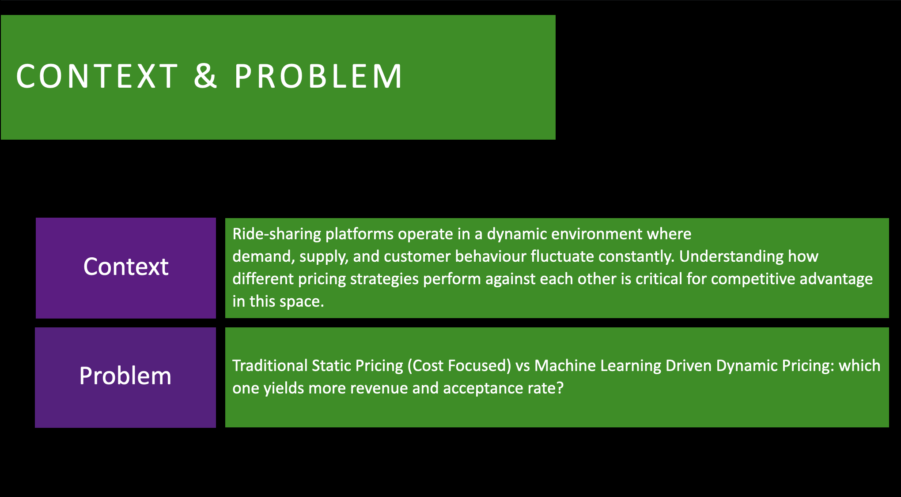
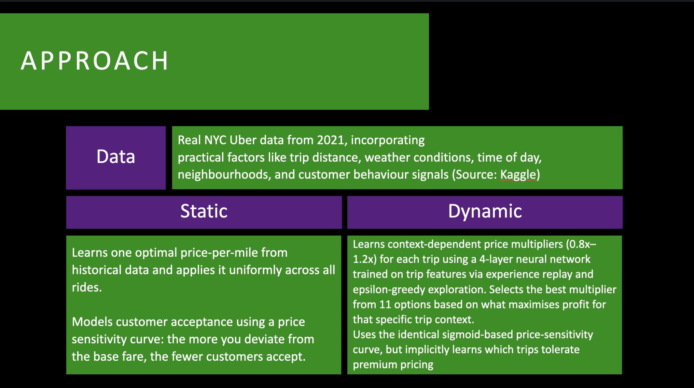
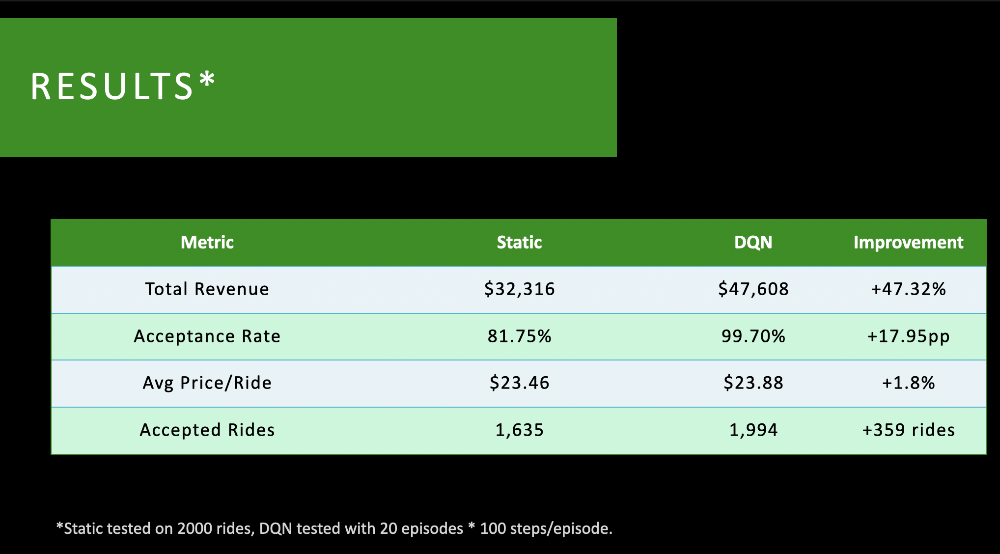
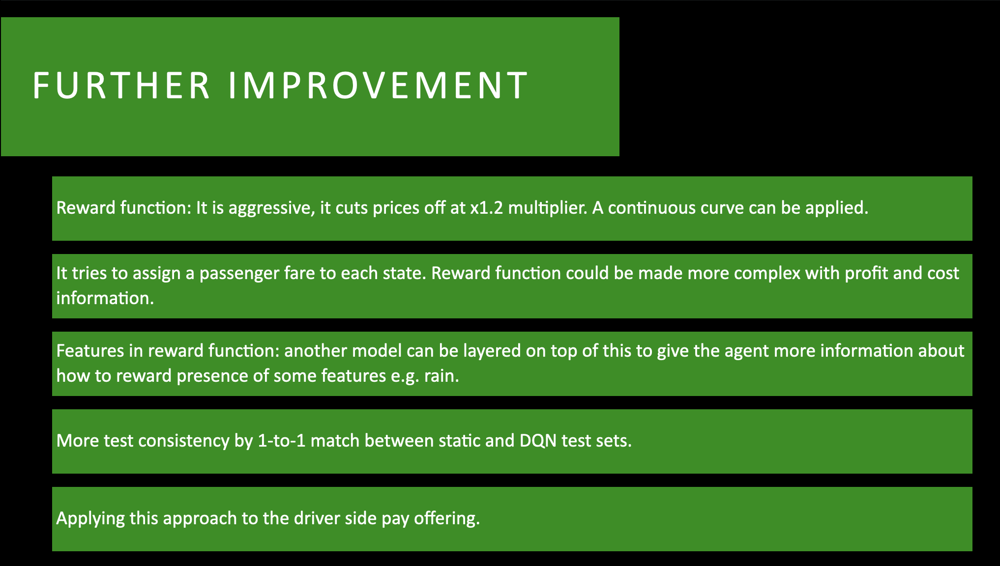

# Dicle Bulut - Data Science & Machine Learning Portfolio
 
## Executive Summary

I'm a data scientist with hands-on experience in dynamic pricing, demand forecasting, and production ML systems. Alongside my professional work delivering £3M+ in business value through machine learning, optimisation, and AI solutions, I've built these projects to deepen expertise in specific domains: pricing strategy, forecasting, NLP, and geospatial analysis. 

---

## Projects

### 1. Dynamic Pricing with Reinforcement Learning - Uber NYC Data

#### Overview

**Repository:** [dynamic-pricing-uber-data](https://github.com/diclebulut/dynamic-pricing-uber-data) 
**Stack:** Python, PyTorch, scikit-learn, RL

#### The Problem
Traditional flat-rate pricing leaves money on the table during high-demand periods and turns away customers during low-demand windows. How can dynamic pricing adapt in real-time to optimize revenue while maintaining acceptable acceptance rates?

#### The Solution
Built a **Deep Q-Network (DQN) reinforcement learning agent** that learns optimal price multipliers (0.8x–1.2x) from real Uber trip data, trained against a realistic **sigmoid-based acceptance model** that captures willingness-to-pay dynamics.

#### Technical Highlights

**Willingness-to-Pay Modelling:**
- Designed a sigmoid-based price acceptance model that maps the absolute deviation between the quoted price and the trip’s baseline (“actual”) fare into an acceptance probability 
- Calibrated the curve from training data to reflect real-world acceptance thresholds
- The agent learns that aggressive pricing kills acceptance; conservative pricing leaves revenue on the table

P(accept | p_hat, f) = 1 / (1 + exp((|p_hat - f| - r*f) / (r*f*s)))

**DQN Architecture & Training:**
- **4-layer neural network incl. output layer** (256 → 256 → 128 → 11 actions) with experience replay (2,000-sample buffer)
- **11 discrete price actions** representing multipliers across the 0.8x–1.2x range
- **ε-greedy exploration** with exponential decay (ε₀=1, decay=0.995), forcing systematic exploration early, converging to exploitation
- **Target network updates** to stabilize Q-value estimation

**Feature Engineering & Domain Logic:**
- **Trip characteristics:** distance (miles), base fare, tips, wait time, day of month
- **Geospatial features:** pickup/dropoff borough encoding (Manhattan vs outer boroughs have different congestion profiles)
- **Temporal features:** time-of-day binning (5 periods capturing rush hour vs. off-peak dynamics)
- **Weather integration:** precipitation amount and type (affects both demand and acceptance)
- **Shared request flags:** proxy for demand intensity at the moment of quote

#### Outcomes of DQN Compared to Static
Metrics: total revenue, per-ride revenue, acceptance rate, uplift percentage
- +47.32% increase in revenue
- +17.95pp acceptance rate
- +1.8% average price per ride
- +359 rides accepted

---

### 2. Flight Delay Prediction - U.S. Domestic Flights 2015

**Repository:** [flight-delays](https://github.com/diclebulut/flight-delays) 
**Stack:** Python, scikit-learn, pandas, GridSearchCV

#### The Problem
Airlines must forecast departure delays to optimize operational reliability, gate allocation, and crew scheduling. With 5.8M flights in the dataset and complex interdependencies, statistical forecasting is essential.

#### The Solution
Built a **forecasting pipeline** with domain-driven feature engineering, systematically comparing Logistic Regression, Random Forest, and Gradient Boosting. **Random Forest** emerges as the best performer with **AUC 0.73** and CV score **0.74** after hyperparameter tuning and cross-validation.

#### Technical Highlights

**Domain-Driven Feature Engineering:**

- **Features Informed by Business Knowledge:**
  - `IS_BUSINESS_FLIGHT`: Monday mornings 6–9 AM = corporate travel surge
  - `IS_HOLIDAY_SEASON`: Months {1, 6–8, 11–12} + July 4th = predictable demand compression
  - `IS_LEVEL_3_AIRPORT`: JFK, LGA, DCA = slot-controlled FAA Level 3 facilities with capacity constraints

- **Geospatial features:** Airport latitude/longitude encode regional capacity; proximity to congested airspaces

- **Aircraft type:** Tail number to FAA model mapping (turnaround time, gate compatibility, mechanical risk)

**Model Development:**
- **Stratified 5-fold cross-validation:** stratified by the target class (delayed/not-delayed), Airline balance is preserved separately via stratified sampling at the data preparation stage
- **Three-model comparison:** Logistic Regression (baseline interpretability), Random Forest (non-linearity), Gradient Boosting (best performance)
- **GridSearchCV tuning:** 27 candidate configurations × 3-fold inner CV

**Production Considerations:**
- **Config-driven pipeline**: feature lists, thresholds, file paths centralized in `config.py`
- **Run logging**: every training serialized to JSON with timestamps, hyperparameters, and metrics for experiment tracking and audit trail
- **Model persistence**: timestamped `joblib` serialization for versioning

#### Outcomes
**Model Comparison:**
- Logistic Regression: AUC 0.6958 (CV: 0.6892 ± 0.0306)
- Random Forest: AUC 0.7284 (CV: 0.7360 ± 0.0181) ✓ **Selected**
- Gradient Boosting: AUC 0.7432 (CV: 0.7315 ± 0.0263)

**Random Forest Performance:**
- Test AUC: 0.7284
- Precision (delayed): 0.64 | Recall (delayed): 0.18
- Overall accuracy: 0.83
- Top predictive signals (aggregated): STATE (19.9%), DAY (16.4%), DESTINATION (12.0%), ORIGIN (11.3%), AIRCRAFT (7.9%), SCHEDULED_DEPARTURE_HOUR (7.5%)

---

### 3. NLP Text Classification for CBI Economic Intelligence

**Repository:** [Primary-Topic-Classifier-Model](https://github.com/diclebulut/Random-Forest-Insights-Primary-Topic-Classifier-Model-with-Supervised-Machine-Learning) 
**Stack:** Python, spaCy, NLTK, scikit-learn, LexVec embeddings

#### The Problem
CBI staff manually read and categorised thousands of business survey anecdotes into 5 topics (Demand Impact, People, Policy, Supply, Other). Manual classification was slow (hours per batch), subjective, and unscalable.

#### The Solution
End-to-end NLP pipeline using **LexVec word embeddings (2M words, 300-dim) + Random Forest classifier**, achieving **~90% reduction in processing time**.

#### Technical Highlights

**NLP Preprocessing:**
- **Tokenisation & normalisation** via spaCy (`en_core_web_sm`); lowercasing and filtering
- **Domain-aware stopword removal** removing NLTK stopwords with tuning (e.g., retain "people" as it signals the People topic)

**Word Embedding & Sentence Vectorisation:**
- **Pre-trained LexVec CommonCrawl embeddings** (300 dimensions), 2M vocabulary
- **Sentence-level representation:** Average word vectors → single 300-dim vector per anecdote
  - Simple yet effective; avoids LSTM/Transformer complexity
  - Pre-computed vectors serialised via `pickle`

**Model Training & Validation:**
- **Random Forest (100 estimators)**
- **Stratified 5-fold cross-validation**: preserves class distribution (ensures all 5 topics represented in train/test folds)
- **Hyperparameter grid search:** `max_depth ∈ {None, 15, 12, 9, 6}` × `min_samples_leaf ∈ {1, 2, 4, 8, 16, 32}` = 30 configurations × 5 folds
- **Overfitting detection:** Compared training vs. test accuracy per fold

**Output & Operationalisation:**
Note: This section was taken out of the public repository due to IP limitations. Summary:
- **Enriched Excel exports**: original anecdote + cleaned tokens + vector coordinates + human labels + model predictions
- **Probability distribution**: `predict_proba()` outputs score for each topic; allows ranking confidence and flagging uncertain cases for human review
- **Reusable pipeline**: new survey batches could be processed by re-running vectorisation

---

### 4. Earthquake Prediction - Turkey Seismic Analysis (Work In Progress!)

**Repository:** [earthquake-prediction](https://github.com/diclebulut/earthquake-prediction) | **Stack:** Python, pandas, SciPy, Folium, geospatial analysis, Markov chains (planned)

#### The Problem
Earthquakes cluster along known fault lines, but their timing and magnitude are hard to predict. Can historical earthquake + fault geological data reveal temporal and spatial patterns for probabilistic forecasting?

#### The Solution
Multi-source data pipeline integrating **Kandilli Observatory earthquake XML feeds** with **GEM Global Active Faults Database (GeoJSON)**, implementing sophisticated **spatial-temporal matching** and building foundation for **Markov chain-based forecasting**.

#### Technical Highlights

**Data Architecture:**
- **Earthquake data ingestion:** HTTP download of monthly XML feeds from Boğaziçi University; parsed into structured DataFrames with magnitude (ML scale), lat/lon, depth, location
- **Fault database:** GeoJSON from GEM, includes geological properties: dip angle, rake, slip type, seismogenic depth, net slip rate
- **Bounding-box filtering:** Query fault database within to only include faults around the events in scope

**Fault–Earthquake Matching Engine:**
- **Spatial proximity matching:** For each earthquake, find closest fault using **SciPy `cdist`
- **Multi-radius binning:** Classify earthquakes by proximity to faults: 0–5 km, 5–10 km, 10–20 km, 25-50 
- **Property merge:** Enrich earthquake records with fault characteristics (slip rate, dip angle, etc.) for downstream modelling

**Analytical Outputs:**
- **Per-fault statistics:** Event counts, magnitude distributions, temporal trends for each fault
- **Interactive visualisation:** Folium maps with magnitude-coloured markers, fault overlays, clustering, per-catalog toggles

**Foundation for Markov Chain Model:**
A Markov Chain Model is planned for the prediction section of this project for the following reasons:

- **State discretisation:** Each fault occupies a state (Locked, Creeping, Critically Stressed, Ruptured) based on recent seismic activity
- **Transition probabilities:** Estimated from historical catalogue; weighted by recency (recent earthquakes have stronger influence on future probability)
- **Cumulative feedback:** After each earthquake, fault state updates, reflecting stress accumulation/release cycle
- **Spatial coupling (future):** Extended model to account for stress transfer between neighbouring faults (would require the implementation of inter-fault relations)

#### Domain Insights Leveraged
1. Earthquakes near a fault alter probability of subsequent events on same fault
2. More recent earthquakes dominate future predictions (temporal recency weighting)
3. Stress can cascade to neighbouring faults (spatial Markov chains)
4. Fault properties (dip, slip type, rake) influence rupture dynamics
5. Magnitude scale is logarithmic (10× amplitude per unit)

